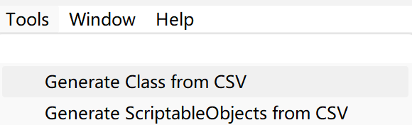
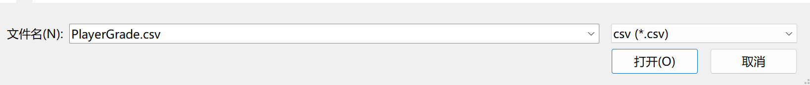
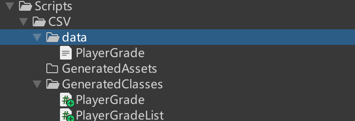
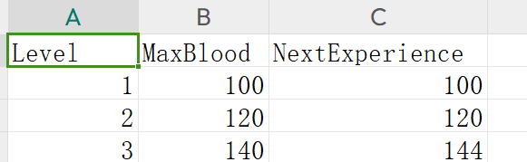
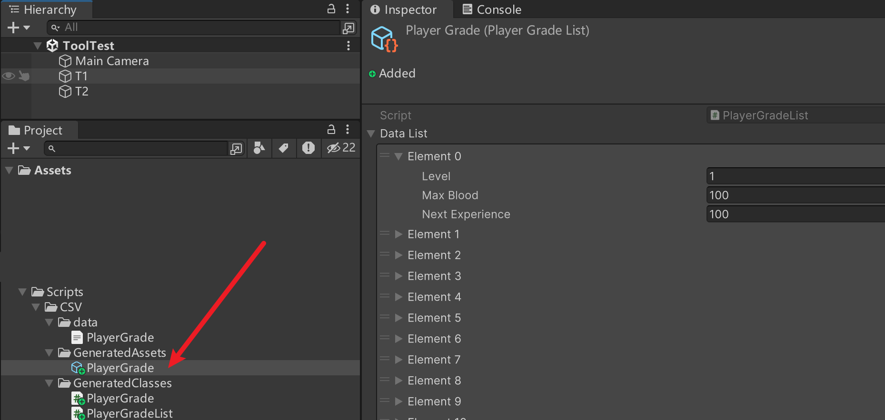

# 简介
简单实现的 CSV 导入工具，根据 CSV 文件名以及字段属性，在 unity 里动态生成对应的类以及ScriptableObject 资产

- 目前仅支持 CSV 的字段导入为 string 和 float。

# 快速使用

1. 导入该包
2. 点击Unity 编辑器上面工具栏新增的 Tool ，点击根据 CSV 生成类，会自动打开文件选择器，选择对应的 CSV!

3. 生成完后的目录(需要修改生成目录可以去 CSVToScriptableObjectMain 文件修改)

   

​	CSV 结构

​	

​	Class 结构(类名根据CSV文件名生成，实际使用需要注意)

```
using System;
[System.Serializable]
public class PlayerGrade
{
    public float Level;
    public float MaxBlood;
    public float NextExperience;

}
```

```
using System.Collections.Generic;
using UnityEngine;

[CreateAssetMenu(fileName = "PlayerGradeList", menuName = "ScriptableObjects/PlayerGradeList", order = 1)]
public class PlayerGradeList : ScriptableObject
{
    public List<PlayerGrade> dataList = new List<PlayerGrade>();
}

```

4. 编译生成好的类文件

5. 点击 Tool 中的生成 ScriptableObjects 资产，再次导入对应的 CSV，生成对应的资产如图所示：

   

